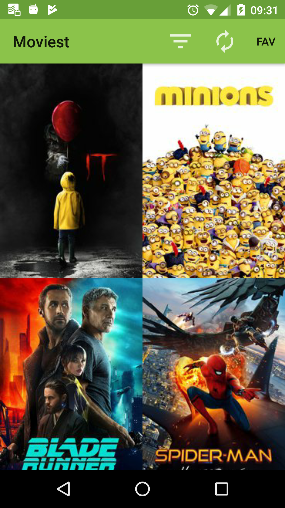
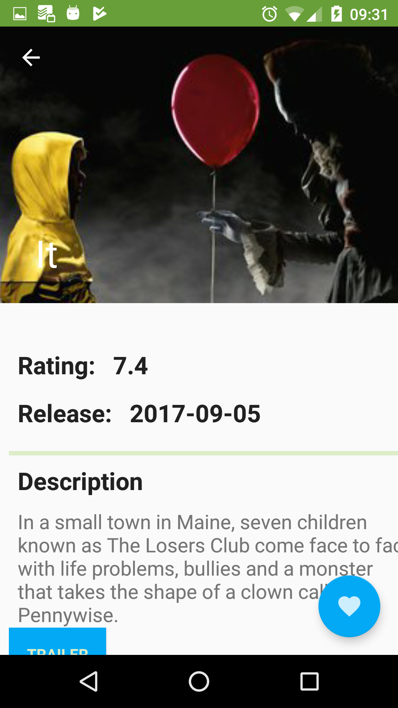

# Movies App

## Description
Android application designed to browse the most viewed movies or most popular. By clicking on a movie poster,
it leads to a Details screen, which shows Rating, Release date, Description, Trailer and User reviews for
the selected movie. You can also add movies to a favourites list by clicking on the favourites button,
for later offline display. Fetches movie data from movieDB.com.  
## Screenshots
 
## Preperation
For licence reason the API key for movieDB.com is not included.  
Before running, please go to java -> utils -> NetworkUtils.java and replace the API_KEY variable with your api key.
